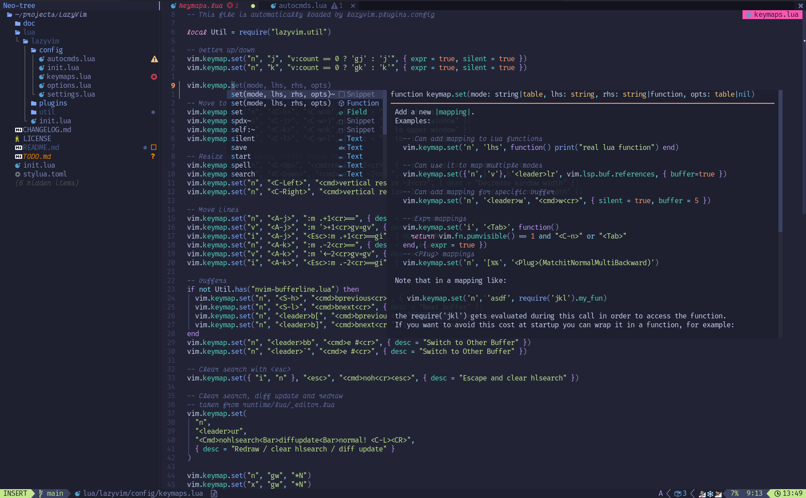
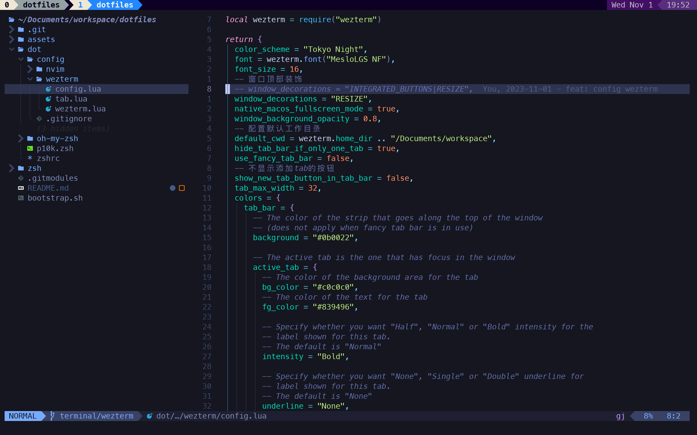

## 效果

### LazyVim



### wezterm



## 说明

仓库中包含

- wezterm
  - 终端软件，功能简单，速度快，跨平台可用
- oh-my-zsh
  - shell工具，让终端命令使用起来更方便
- powerlevel10k(p10k)
  - shell主题
- zshrc
  - shell配置，比如命令别名等
- nvim
  - `NeoVim`。比`Vim`功能更强大

## 应用步骤

### 安装`assets/font`中的字体

因为`oh-my-zsh`的主题使用了`powerlevel10k`，需要安装`assets/font`中的字体，否则主题中的一些字体图标就会显示不出来

### 安装`NeoVim`、`wezterm`

需要去官网安装对应的软件。如是`Mac`系统，安装`brew`即可

`wezterm`最好下载安装包，使用`brew`安装，可能有网络问题

### 安装配置文件

- 拉取本仓库代码
- 执行安装脚本

```sh
git clone https://github.com/xpzero/dotfiles.git --recurse-submodules
cd dotfiles && ./bootstrap.sh
```

#### 脚本代码思路

1. 查找`dotfiles/dot/`下的所有文件(夹)
2. 如果上面的文件(夹)添加`$HOME/.`前缀后，可在家目录中找到，且不是软链接类型，则为其创建备份(原文件(夹)重命名为带有`.bak`的文件(夹))
3. 将`dotfiles/dot/`下的所有文件(夹)添加`$HOME/.`前缀，软链接到家(这里是`$HOME`)目录
4. 将`dotfiles/zsh/`下的所有文件夹根据其名字链接到`dotfiles/dot/oh-my-zsh/`下对应的目录中

##### 注意

`oh-my-zsh`、`powerlevel10k`等都是作为当前项目的子模块存在于repo目录中的。

普通克隆不会安装子模块，需要使用`--recurse-submodules`参数进行递归克隆。

子模块的repo地址都是github域名，网络问题需要考虑下。比如使用github域名的host代理解决下载问题。
