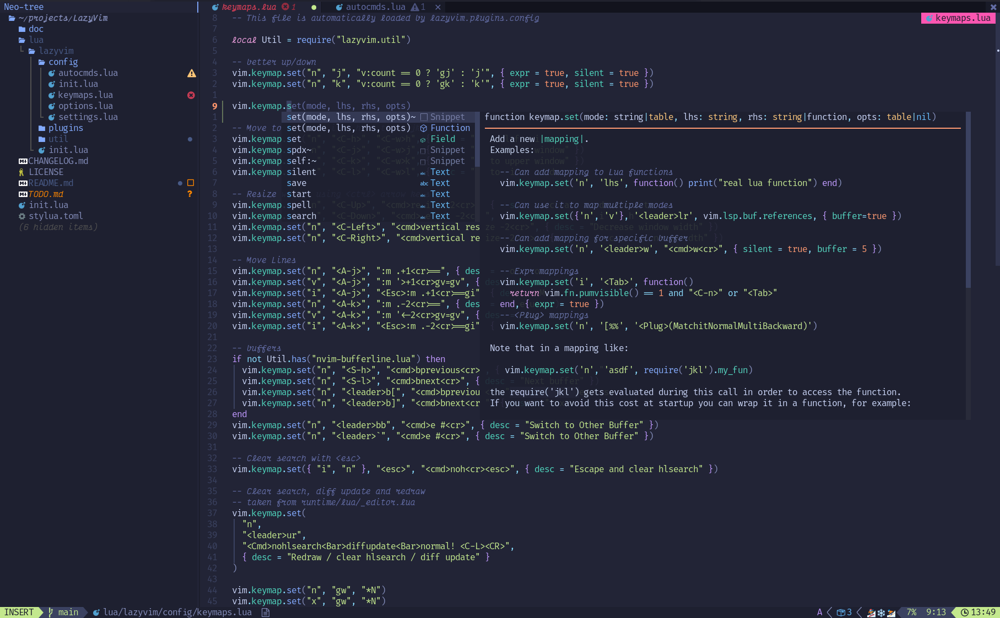
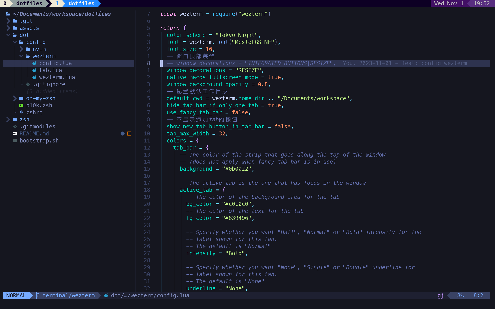

## 效果

### LazyVim



### wezterm



## 说明

仓库中包含

- wezterm
  - 终端软件，功能简单，速度快，跨平台可用。
- nvim
  - `NeoVim`。比`Vim`功能更强大
- fish
  - shell工具
- starship
  - 命令提示符美化

## 安装

支持 macOS 和 Ubuntu/Debian。macOS 安装 Docker Desktop；Ubuntu/Debian 安装 Docker Engine。

```sh
curl --http1.1 --retry 5 --retry-all-errors --retry-delay 2 -fsSLo /tmp/dotfiles-bootstrap.sh \
  https://raw.githubusercontent.com/xpzero/dotfiles/refs/heads/main/bootstrap.sh && \
/bin/bash /tmp/dotfiles-bootstrap.sh
```

Ubuntu/Debian 安装 Docker 后需要重新登录，才能无需 `sudo` 执行 `docker`。

### 脚本代码思路

1. 查找`dotfiles/dot/`下的所有文件(夹)
2. 如果上面的文件(夹)添加`$HOME/.`前缀后，可在家目录中找到，且不是软链接类型，则为其创建备份(原文件(夹)重命名为带有`.bak`的文件(夹))
3. 将`dotfiles/dot/`下的所有文件(夹)添加`$HOME/.`前缀，软链接到家(这里是`$HOME`)目录
4. 使用`brew`安装需要的软件
